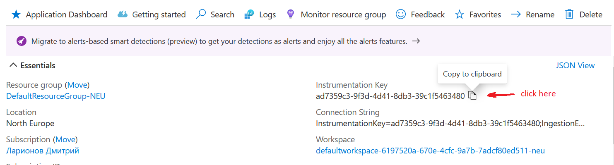

# Execution phase

## Preparation

1. Register to Azure (https://azure.microsoft.com/free/).
2. Deploy instance of Application Insights.
3. Take an instrumentation key this way:



4. Open a command line and execute:

```bash
export APPINSIGHTS_INSTRUMENTATIONKEY=..key..
```

or (if you are in PowerShell):

```powershell
$env:APPINSIGHTS_INSTRUMENTATIONKEY=..key..
```

Don't close terminal, use it to build and run.

# Build and run

1. Start everything and attach to CLI:

```
docker-compose run cli
```

2. Play with scenarios 1-2-3-4 in any order. Make your observations (see [below](#Making-observations)).
5. Wait 5 minutes to be sure statistics is processed.
6. Press `Ctrl`+`C` to stop `cli` container.
7. Stop everything else:

```
docker-compose down
```

#### Making observations

While playing with scenarios make your observations:

- Which scenario never fail?
- Which scenario always fail?
- Which scenario has stable failure rate?
- Which scenario has increasing failure rate?
- Which scenario is lagging?

Can you suppose why some scenario is lagging?

Can you suppose why some scenario failure rate isn't stable?

# Analysis phase

## Overview

Take a look at the application map in overview section.

1. Can you determine what services are in place and their relations?
2. Do you see a client app? Can you suppose, why?
3. Nevertheless, can you determine the failure rate for a client?
4. What is top 3 failing requests for a client?
5. What of the failing client requests are a problem (while others are not)? Why others are not?
6. Can you exclude those probably legitimate failures to focus on problematic ones?
7. Which path is the hottest one (has most of the requests)?
8. Which service receives most of the requests?

## Investigation

Go to investigation section.

1. Where always failing scenario fails?
2. Where one of the first two scenarios fail? Which service? Line of code?
3. Why another one of the first two scenarios isn't affected by the same cause?
4. Why `pet` failure rate is greater than failure rate of its dependencies? How can we strengthen it?
5. What goes on with the scenario with increasing failure rate?
6. What is the slowest request for a client in average? In 95th and 99th percentile?
7. Who is faster `dog` or `cat`? Why care about percentile?
8. Where the slowest client requests spend most of the time?
9. Why one of the scenarios lagging?
10. How can you quickly check outburst latency for reviewed request / dependency?
11. How can you see custom event metrics? Group them by vaccine, pet name and kind.
12. How can you see logs? Filter them by severity level.
